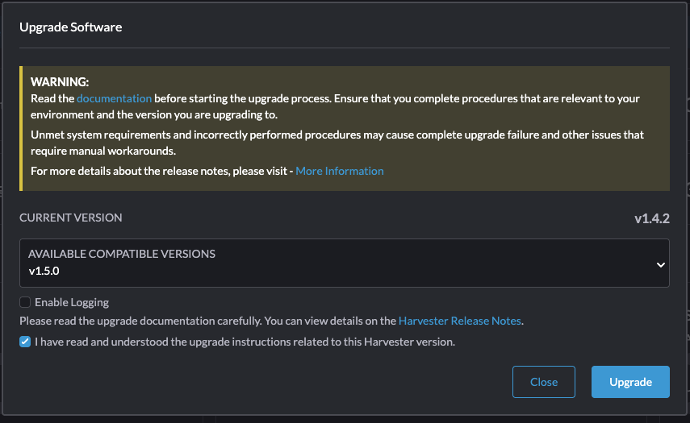
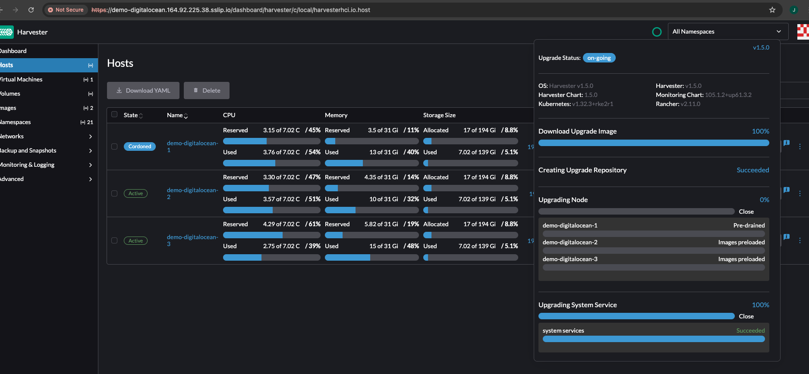
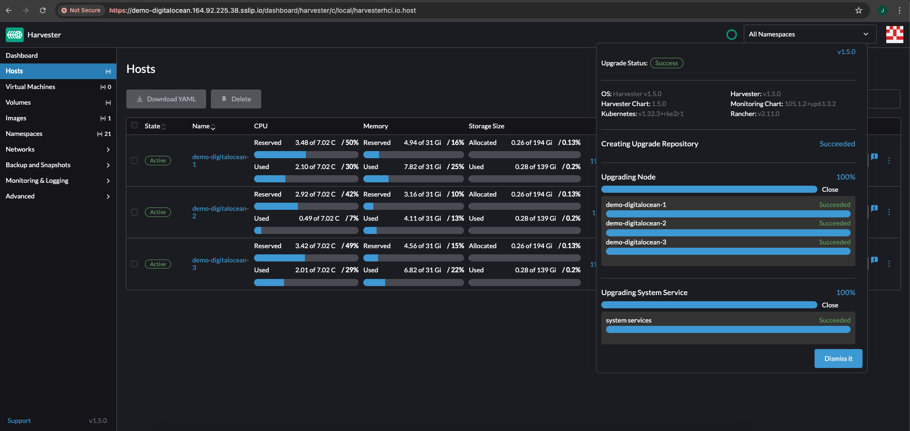

# How to Perform an Upgrade in an Air-Gapped Harvester Cluster Deployed Using the Harvester Cloud Project

When deploying a Harvester cluster using the Harvester Cloud project, it is possible to restrict internet access to the Harvester nodes by setting the `harvester_airgapped` variable to `true`.

In this mode, specific iptables rules will be applied on the host system to block all inbound and outbound traffic between the Harvester nodes and the Internet.

However, access to the Harvester console and command-line tools will remain available from outside the nodes' network, ensuring manageability in air-gapped environments.

## Prerequisites

Before proceeding with the upgrade, it's important to understand the architecture of the Harvester Cloud project. In this setup, Harvester nodes run as nested virtual machines (VMs) inside a single cloud host (also referred to as the "Cloud VM").

Each Harvester node is backed by a separate data disk attached to the Cloud VM:

```console
           |→ Data Disk 1 → Harvester Node 1
CLOUD VM --|→ Data Disk 2 → Harvester Node 2
           |→ Data Disk 3 → Harvester Node 3
```

This architecture allows the cloud host to control the lifecycle and networking of all Harvester nodes.

#### Understanding Internet Access in Air-Gapped Deployments

When the `harvester_airgapped` variable is set to `false`, Harvester nodes are allowed to access the internet. In this case, the cloud host (where the nested Harvester VMs run) acts as a gateway, and no restrictions are applied to outbound traffic.

However, when `harvester_airgapped` is set to `true`, internet connectivity from the Harvester nodes is explicitly blocked through host-level firewall (iptables) rules. This ensures that the nodes operate in a **fully air-gapped environment**, disconnected from any external public network.

In such scenarios, administrators must be familiar with how to handle operations that typically require internet access — such as uploading VM images — since public repositories will no longer be reachable from inside the cluster.

Fortunately, the Harvester Cloud project configures an internal **NGINX web server** on the cloud host. This server serves files from `/srv/www/harvester` and is accessible at the internal address `http://192.168.122.1`, which belongs to the same private network used by the Harvester nodes. This makes it possible to reuse the NGINX server as a local image repository or endpoint for other resources needed during upgrades or provisioning.

#### How to Upload an Image in an Air-Gapped Environment Deployed with the Harvester Cloud Project

##### Login into the public host through SSH

```console
terraform output
first_instance_public_ip = "164.92.225.38"
harvester_url = "https://demo-digitalocean.164.92.225.38.sslip.io"
longhorn_url = "https://demo-digitalocean.164.92.225.38.sslip.io/dashboard/c/local/longhorn"
 javierlagos@MacBook-Pro-de-Javier  ~/PycharmProjects/harvester-cloud/projects/digitalocean  ssh -i demo-digitalocean-ssh_private_key.pem opensuse@164.92.225.38
Have a lot of fun...
Last login: Wed Jun  4 10:26:49 2025 from 83.36.3.177
opensuse@node-demo-digitalocean-1:~> sudo -i
node-demo-digitalocean-1:~ # 
```
##### Download the desired image to be uploaded on Harvester on `/srv/www/harvester`

```console
node-demo-digitalocean-1:~ # curl -L -o /srv/www/harvester/opensuse-Leap-15.6.qcow2 https://download.opensuse.org/distribution/leap/15.6/appliances/openSUSE-Leap-15.6-Minimal-VM.x86_64-Cloud.qcow2
  % Total    % Received % Xferd  Average Speed   Time    Time     Time  Current
                                 Dload  Upload   Total   Spent    Left  Speed
  0     0    0     0    0     0      0      0 --:--:--  0:00:02 --:--:--     0
100  266M  100  266M    0     0  19.8M      0  0:00:13  0:00:13 --:--:-- 20.8M
node-demo-digitalocean-1:~ # ls -lhrt /srv/www/harvester/opensuse-Leap-15.6.qcow2
-rw-r--r-- 1 root root 267M Jun  4 10:37 /srv/www/harvester/opensuse-Leap-15.6.qcow2
```
##### Create the image pointing to the NGINX server configured on IP `http://192.168.122.1`


##### An error event will be triggered if an image is uploaded by using a public repository


## Harvester Air-Gapped Upgrade Process

##### Log in to the Public Host via SSH

```console
terraform output
first_instance_public_ip = "164.92.225.38"
harvester_url = "https://demo-digitalocean.164.92.225.38.sslip.io"
longhorn_url = "https://demo-digitalocean.164.92.225.38.sslip.io/dashboard/c/local/longhorn"
 javierlagos@MacBook-Pro-de-Javier  ~/PycharmProjects/harvester-cloud/projects/digitalocean  ssh -i demo-digitalocean-ssh_private_key.pem opensuse@164.92.225.38
Have a lot of fun...
Last login: Wed Jun  4 10:26:49 2025 from 83.36.3.177
opensuse@node-demo-digitalocean-1:~> sudo -i
node-demo-digitalocean-1:~ # 
```

##### Download the ISO of the Desired Harvester Version to `/srv/www/harvester/harvester.iso`

You can find the release ISOs on the [Harvester GitHub releases page](https://github.com/harvester/harvester/releases).

```console
node-demo-digitalocean-1:~ # curl -L -o /srv/www/harvester/harvester.iso https://releases.rancher.com/harvester/v1.5.0/harvester-v1.5.0-amd64.iso
  % Total    % Received % Xferd  Average Speed   Time    Time     Time  Current
                                 Dload  Upload   Total   Spent    Left  Speed
100 6891M    0 6891M    0     0  40.5M      0 --:--:--  0:02:49 --:--:-- 42.0M
```

##### Create the Harvester Upgrade Object in the Cluster

Define and apply the upgrade object YAML using `kubectl`.

```console
apiVersion: harvesterhci.io/v1beta1
kind: Version
metadata:
  name: <Harvester-version>
  namespace: harvester-system
spec:
  isoURL: http://192.168.122.1/harvester.iso 
  releaseDate: '20250425'
```

```console
 javierlagos@MacBook-Pro-de-Javier  ~/PycharmProjects/harvester-cloud/projects/digitalocean  export KUBECONFIG=demo-digitalocean_kube_config.yml 
 javierlagos@MacBook-Pro-de-Javier  ~/PycharmProjects/harvester-cloud/projects/digitalocean  cat upgrade-v1.5.0.yaml 
apiVersion: harvesterhci.io/v1beta1
kind: Version
metadata:
  name: v1.5.0
  namespace: harvester-system
spec:
  isoURL: http://192.168.122.1/harvester.iso
  releaseDate: '20250425'
 javierlagos@MacBook-Pro-de-Javier  ~/PycharmProjects/harvester-cloud/projects/digitalocean  k apply -f upgrade-v1.5.0.yaml 
version.harvesterhci.io/v1.5.0 created
```

##### The Upgrade Button Will Appear in the Harvester Dashboard




**Note: If logging is enabled, upgrade-related logging pods will attempt to pull images from DockerHub. This will fail in an air-gapped environment unless the required images are preloaded on each node.**

##### Click the `Upgrade` Button to Start the Upgrade




