# How to create resources

- Copy `./terraform.tfvars.example` to `./terraform.tfvars`
- Edit `./terraform.tfvars`
  - Update the required variables:
    - `harvester_url` to specify the URL of the Harvester cluster API
    - `kubeconfig_file_path` to specify the full path to the Kubeconfig file, which is required to authenticate with the Harvester cluster
    - `kubeconfig_file_name` to specify the name of the Kubeconfig file used to access the Harvester cluster
    - `private_ssh_key_file_path` to specify the full path where the private SSH key file is located
    - `private_ssh_key_file_name` to specify the name of the private SSH key file used for authentication
    - `cluster_network_count` to specify the number of NIC's to be created on Harvester Nested VM's. The first NIC created on each Harvester node will be configured as VM network on Harvester while the rest of NIC's will remain available to be configured manually.

#### Terraform Apply

```bash
terraform init -upgrade && terraform apply -auto-approve
```

#### Terraform Destroy

```bash
terraform destroy -auto-approve
```

#### OpenTofu Apply

```bash
tofu init -upgrade && tofu apply -auto-approve
```

#### OpenTofu Destroy

```bash
tofu destroy -auto-approve
```

## Description of the recipe

1. Create a second Virtual Network on the VM in the cloud (default name: `vlan2`).
2. Connect the newly created Virtual Network to the Harvester nodes (which are nested VMs).
3. Using Harvester's Terraform Provider, create a VM Network on the Harvester cluster.

**This recipe will perform a rolling reboot of the Harvester nodes.**

#### The process flow

VM in the cloud > (libvirt) Virtual Network *vlan2* > (libvirt) Attach network interface > (libvirt) Reboot VMs > Harvester nodes > VM Network

## Clean up the Virtual Machine (Cloud)

**Running `Terraform Destroy` will not delete the Virtual Network (libvirt) and will not detach the NIC from nested Harvester VMs.**

Obviously destroying the cluster solves the problem, but if you just want to roll back the configurations you made, run the script below:

```console
$ ssh -oStrictHostKeyChecking=no -i <PREFIX>-ssh_private_key.pem <SSH_USERNAME>@<PUBLIC_IPV4>
$ sudo su -
$ cat << 'EOF' > detach-network-interface.sh
#!/bin/bash

CLUSTER_NETWORK_VLAN_NIC="virbr" # Default value
NETWORK_NAME="vlan" # Default value
NODE_COUNT=$(sudo virsh list --all | grep -c "running")
NETWORK_COUNT=$(virsh net-list --all | awk '$2 == "active" && $1 != "vlan1" {print $1}' | wc -l)

for i in $(seq 1 $NODE_COUNT); do
  for j in $(seq 1 $NETWORK_COUNT);do
    MAC_ADDRESS=$(sudo virsh domiflist harvester-node-$i | grep $CLUSTER_NETWORK_VLAN_NIC$(($j + 1 )) | awk '{print $5}')
    if [ -n "$MAC_ADDRESS" ]; then
      echo "Detaching interface with MAC $MAC_ADDRESS from harvester-node-$i."
      sudo virsh detach-interface --domain harvester-node-$i --type bridge --mac $MAC_ADDRESS --config --live
    fi
  done
done

for i in $(seq 1 $NODE_COUNT); do
  echo "Rebooting harvester-node-$i"
  sudo virsh reboot harvester-node-$i
  echo "Node harvester-node-$i rebooted, waiting for it to come back online..."
  TIMEOUT=300
  TIMER=0
  until sudo virsh list --all | grep "harvester-node-$i" | grep -q "running"; do
    echo "Waiting for harvester-node-$i to restart..."
    sleep 10
    TIMER=$((TIMER+10))
    if [ "$TIMER" -ge "$TIMEOUT" ]; then
      echo "Error: harvester-node-$i did not come back online within $TIMEOUT seconds."
      exit 1
    fi
  done
  echo "harvester-node-$i is back online."
done

for i in $(seq 1 $NETWORK_COUNT); do
  echo "Destroying and undefining the network $NETWORK_NAME$(($i + 1))"
  sudo virsh net-destroy --network $NETWORK_NAME$(($i + 1)) || true
  sudo virsh net-undefine --network $NETWORK_NAME$(($i + 1)) || true
done

ATTEMPS=0
HARVESTER_URL="<HARVESTER_URL>" # Example https://<PREFIX>.<PUBLIC_IP4>.sslip.io

while [ "$ATTEMPS" -lt 15 ]; do
  RESPONSE=$(curl -k -s "$HARVESTER_URL/ping")
  if [ "$RESPONSE" == "pong" ]; then
    echo "Waiting for $HARVESTER_URL/ping - response: $RESPONSE"
    ((ATTEMPS++))
  else
    echo "Waiting for $HARVESTER_URL/ping - response is not 'pong', retrying in 2 seconds..."
  fi
  sleep 2
done
EOF
$ chmod +x ./detach-network-interface.sh
$ sh ./detach-network-interface.sh
```
**Remember to initialize `HARVESTER_URL` variable.**

**This script will perform a rolling reboot of the Harvester nodes.**

# DEMOSTRATION - Given a Harvester cluster, create a VM Network with all related resources

#### Harvester Cluster - UI | Cluster Network | Virtual Machine Networks - PRE-DEPLOY


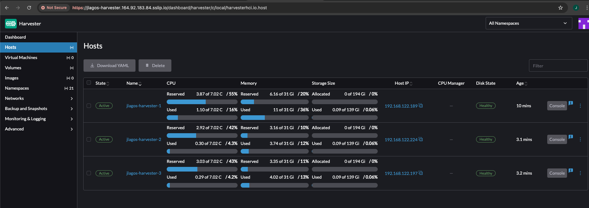


#### Configure the terraform.tfvars file with the minimum necessary configurations

```console
$ cat terraform.tfvars
harvester_url             = "https://jlagos-harvester.164.92.183.84.sslip.io"
kubeconfig_file_path      = "../../digitalocean/"
kubeconfig_file_name      = "jlagos-harvester_kube_config.yml"
private_ssh_key_file_name = "jlagos-harvester-ssh_private_key.pem"
private_ssh_key_file_path = "../../digitalocean/"
ssh_username = "opensuse"
cluster_network_count = 3
```

#### Demonstration of applying Terraform files


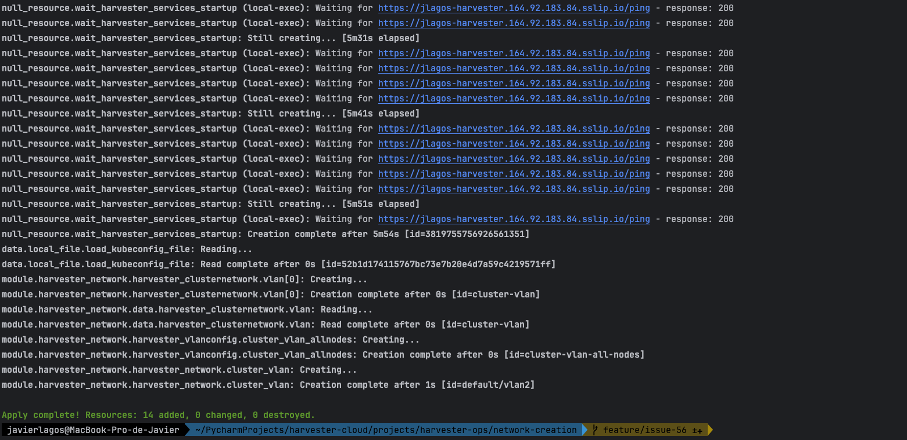

#### Harvester Cluster - UI | Cluster Network | Virtual Machine Networks - POST-DEPLOY


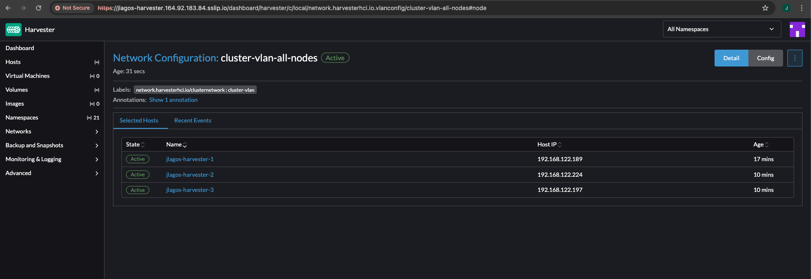
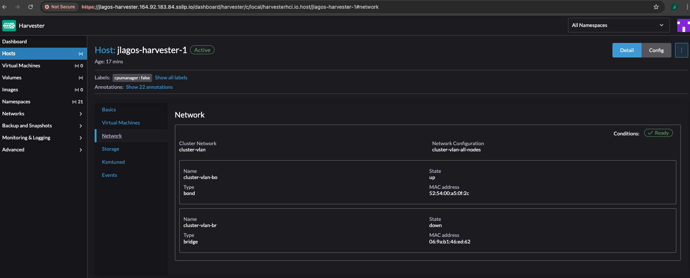

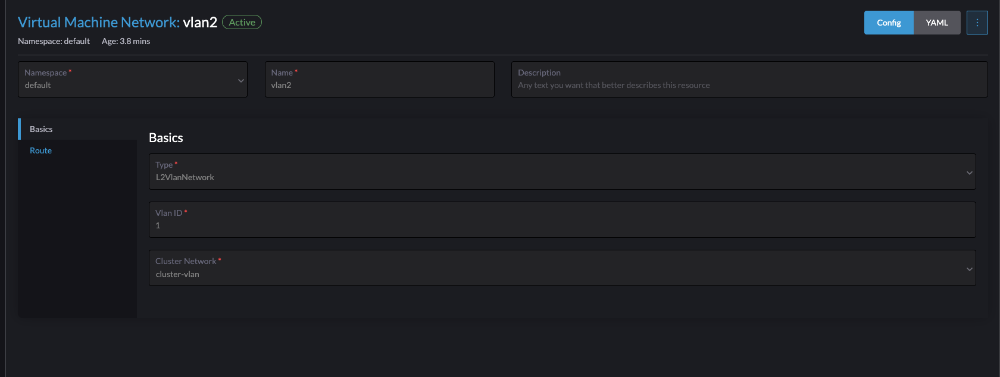
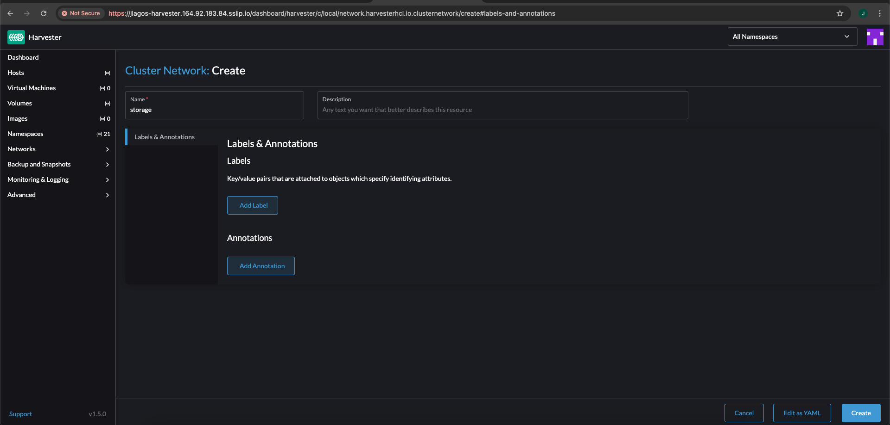
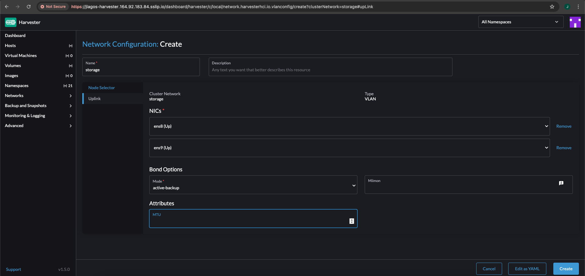
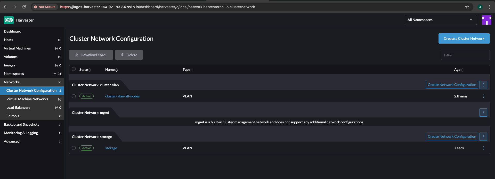

#### Check on the VM

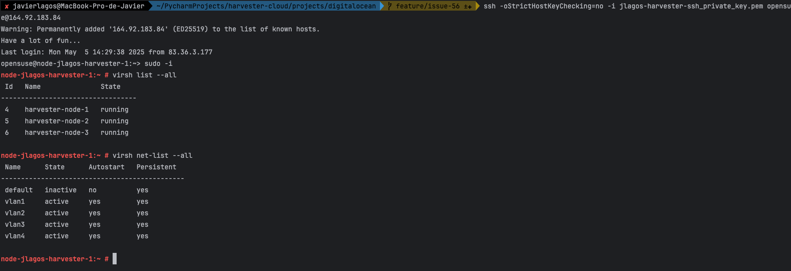

#### Demonstration of Terraform destroy

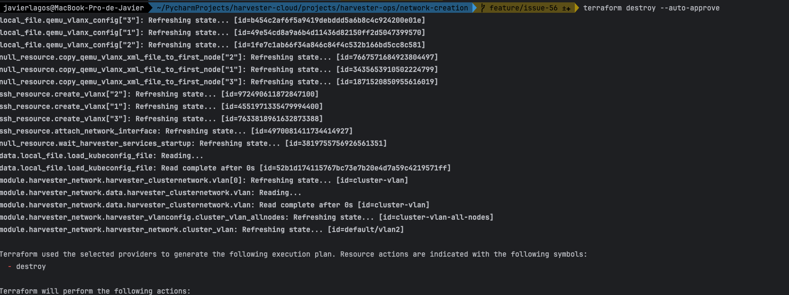
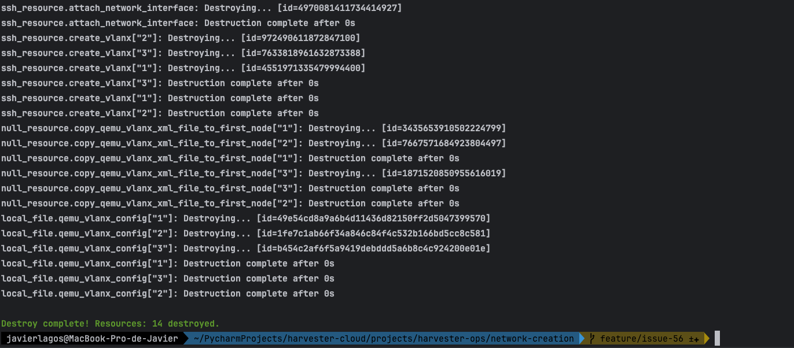


#### Harvester Cluster - UI | Cluster Network | Virtual Machine Networks - POST-DESTROY

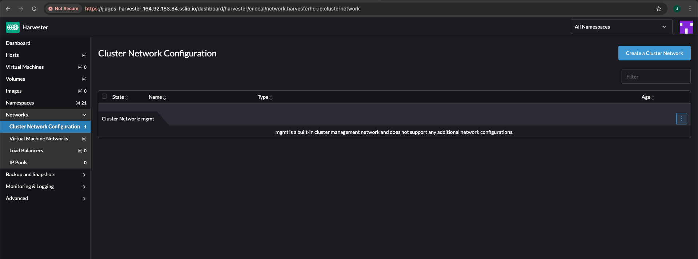


#### Deletion of the Virtual Network and detachment of the NIC from the nested VMs

1. Copy the above script and initialize the variables `HARVESTER_URL`


2. Run the script

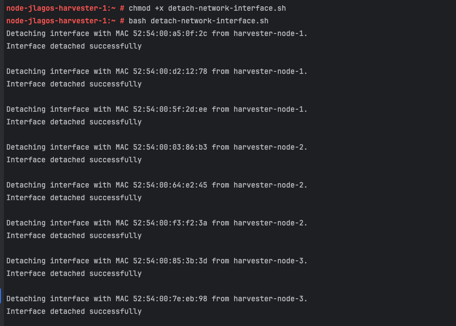

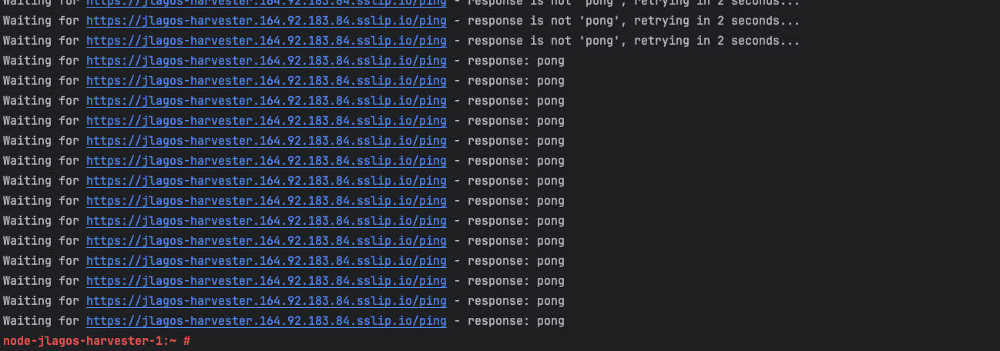


3. Double checks

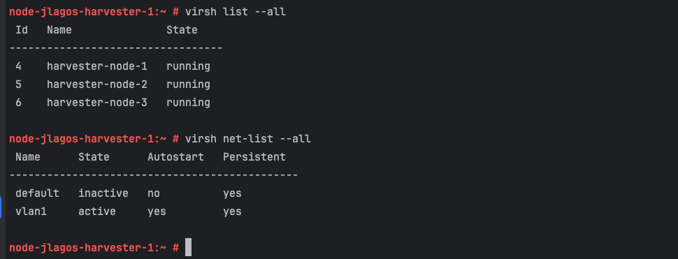

